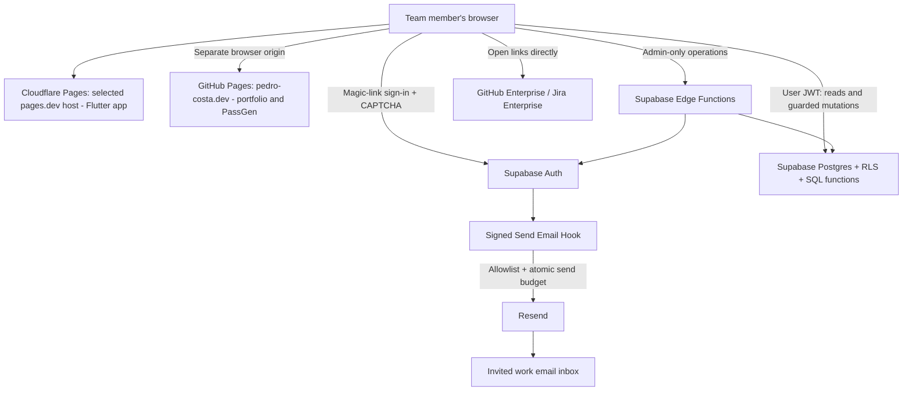

# Architecture

Updated: 2026-09-26. P11 adds local revision checks, filters and bounded pages;
see [REFRESH](REFRESH.md). P10 adds local archive/restore/admin recovery; see [LIFECYCLE](LIFECYCLE.md).
P09 adds local comments/review signals; see [ACTIVITY](ACTIVITY.md).
P08 adds locally verified ordering/reordering; P07 adds queue CRUD/ownership. See [QUEUE](QUEUE.md).
P06 adds locally verified onboarding; see [ONBOARDING](ONBOARDING.md).
P04/P04A local authentication and root callbacks are verified.
P05 adds the Resend adapter, Turnstile bridge and strict loopback hosted-trial
configuration. The controlled hosted trial passed; the temporary admission is
revoked. Inbox placement and app publication remain release work. [AUTH](AUTH.md) covers local development;
[HOSTED_AUTH](HOSTED_AUTH.md) records trial configuration and live evidence.

## Design

Use Flutter Web with Supabase for authentication, relational data, and server-side authorization. Deliver magic links through Resend using the existing verified sender. The owner selected Cloudflare Pages Free at an available `<project>.pages.dev` address for this repository's Flutter build. P11A prepares this change before P12; no deployment exists. The portfolio and PassGen remain separate deployments on their existing hostname.



The browser never receives database admin credentials or Resend credentials. No backend request goes to GitHub Enterprise or Jira. The public HTML/Flutter bundle is not confidential; team data requires authorization.

## Hosting on Cloudflare Pages (prepared locally 2026-09-26; not deployed)

Use an available **`https://pr-review-queue.pages.dev/`** with base href `/`. Keep hash routes, such as `/#/teams/<id>`, and the root entry document as the magic-link callback, retaining fragment cleanup and explicit confirmation. Cloudflare validated this exact name as available in P11A; it remains unreserved. [Flutter URL configuration](https://docs.flutter.dev/ui/navigation/url-strategies)

Prepare this app's `frontend/build/web` artifact independently, using a prebuilt upload workflow. No combined portfolio artifact, personal-domain CNAME, new organization or repository visibility change is needed for Direct Upload. See [HOSTING](HOSTING.md) for P11A scope and [COSTS](COSTS.md) for current limits.

Hosting stages:

1. P11A prepared exact production/local/trial configuration, root callback guards, dashboard Direct Upload preflight and provider checklist locally.
2. Review completed local release/restore checks in P12 and its future rollout gates. Keep Namecheap sender/portfolio records; the old app-specific `reviews` CNAME is unnecessary if it was added.
3. In separately selected P13, create/publish the Cloudflare Pages project, apply reviewed provider settings and verify live HTTPS, login and origin separation.

Source: [Cloudflare Pages Direct Upload](https://developers.cloudflare.com/pages/get-started/direct-upload/). D35 supersedes D27's custom-domain publishing plan; the local root implementation remains useful.

P04A now uses `http://127.0.0.1:4173/` consistently for the build/preview, early callback handler, client gate, Supabase local Site URL, sender validation, startup environment and tests. The old preview prefix returns 404 without a redirect; callback guards reject old paths and other origins. AUTH/frontend README contain tested replacement commands. This is a working local root build, not a deployed or hosted-auth-enabled subdomain.

P05 uses only `http://127.0.0.1:4173/` and a separate managed Turnstile widget for
`127.0.0.1`. The selected pages.dev production Site URL/callback and its separate
widget have a P11A settings checklist and need live activation/verification in P13.
P11A production mode requires the exact Pages root and public hosted keys; hosted activation remains P13. Do not
accept wildcard/portfolio redirects or forward login fragments between origins.

Cloudflare Pages serves the static frontend; Supabase runs backend code. No Pages Functions, Workers backend or paid service is proposed. Recheck actual account limits and the release artifact before publication.

The dedicated pages.dev hostname creates a distinct browser origin from the portfolio and PassGen. Its app storage and service workers are origin-scoped. Keep this hostname dedicated to the PR app and retain backend authorization. See [Security](SECURITY.md).

## Frontend

P12 release tooling is in [RELEASE](RELEASE.md): two clean locked builds,
source/config/asset hashes, static headers with exact backend CSP, bundled
renderers and a bootstrap without service workers. Packages stay ignored/local;
the manual Pages upload is P13. Its tenth migration removes the temporary trial
mail branch while retaining revoked evidence. Restricted encrypted local backups
include application, private/Auth data and migration history; hosted Auth/config/
secret recovery is separately documented and is not proved by the local rehearsal.

P02 implementation: feature folders under `frontend/lib/`, a small read-only `QueueRepository` with fictional display models, Material themes, `go_router` 18.0.1 using its default hash strategy, and `shared_preferences` 2.5.5 through `SharedPreferencesAsync`. The lockfile is pinned. Theme preference is loaded before first rendering, defaults to dark independently of OS theme, and reports unavailable storage without blocking the app. P04 adds pinned supabase_flutter 2.17.2 behind a small repository/controller; no extra state-management package.

Routes are `/`, `/teams/:teamId`, `/teams/:teamId/archive`, and `/teams/:teamId/profiles/:profileId`; unknown routes/IDs show a recovery screen. There is no signed-in demo identity or authentication bypass. The fictional profiles and entries are public static presentation data, not protected team records. The local P03 database boundary is implemented separately; the queue shell does not use it. P04 connects only authentication in the exact-loopback preview. P04A verified root/hash-route compatibility; hosted Pages compatibility awaits rollout.

- Flutter Web only; Material components, responsive queue, dark default and saved light preference.
- Start with feature folders: `auth`, `teams`, `queue`, `archive`, `profiles`, and small shared UI/services.
- Use the pinned routing package for deep links; P04 verified local auth callback compatibility. Keep state management minimal until multiple screens justify a package.
- Use the maintained Supabase Flutter client behind a small repository interface; fake repositories support the local shell. Domain models should not import widget code.
- P04 uses a custom sessionStorage adapter with memory fallback. The SDK synchronizes already-open same-origin app tabs through BroadcastChannel; this is not per-tab isolation. Auth localStorage persistence is disabled. See AUTH for limits.
- No tokens in URLs after callback processing, no auth data in analytics, and no offline caching of team data.
- No Realtime subscription in version 1. Refresh after successful writes, on tab return, manually, and at most once per 60 seconds while visible.

## Backend organization

P07 connects `EntryRepository`/`EntryQueue` to the signed-in root workspace.
The fifth migration adds `create_entry`, `update_entry`, `delete_entry` and
`queue_link_hosts`. They derive identity, require live membership, recheck after
the team lock, enforce owner/admin writes and optimistic versions, and retain
denied direct table writes. Private exact-host configuration is empty by default;
only local test helpers insert fictional hosts. Low/Medium/High/Critical replaces
the preparatory priorities, with an explicit Normal-to-Medium migration.
See QUEUE for canonical links, mutation budgets, conflict recovery and audit data.
P08's sixth migration adds a stable `queue_snapshot` RPC returning ordered rows
and their revision together, plus admin-only `move_entry` backed by a private
transaction. It reuses P07 budgets/team locks, validates same-team/group targets,
checks revisions, shifts affected positions and preserves content versions.
Sorting precedes the 100-row display limit. Hosted P06–P09 is unperformed.

P09's seventh migration adds an authorized stable activity snapshot, guarded
comment add/edit/delete and per-user signal set/clear. It reuses queue budgets
and team/entry lock order with post-lock membership/role checks. Authors may edit;
authors/admins may soft-delete comments with optimistic comment versions. Signals
derive identity and reject self-review, including admins. A PR-link-change trigger
clears signals in the same entry-edit transaction; stale review requests conflict
on entry version. Activity advances only data revision. P11 pages details at 25
comments/reviewers with full counts and stable revision checks. Flutter renders plain text in expandable
entry panels; no external posting or new service is involved.

P06 now connects the signed-in root workspace to real teams and profiles.
`invite-member` verifies Auth `/user`, prepares with the caller JWT, and uses a
service-only RPC to reconcile an exact invitation with Auth. It never sends mail
or returns admin credentials. Client delivery retains the existing CAPTCHA/hook
flow. The fourth migration binds invitations to provisioned Auth IDs and adds
transactional verified-email claiming, self profile editing and shared-active-team
email disclosure. A private fixed-window mutation budget protects onboarding,
including the wrapped P03 membership RPC. Direct writes stay denied. P06 is local
only; the hosted project still has the three P03–P05 migrations.

P03 now provides project-local Supabase CLI 2.117.0, Docker config, the initial migration, local SQL-role/Data API tests, fictional test fixtures, and an operator bootstrap script. The sign-in screen was connected in P04 and the real queue in P07. `private` is excluded from the exposed API schemas. Public reads use explicit grants and live-membership RLS; all direct writes are denied. Global and schema-scoped function default grants are revoked, including PostgreSQL's default PUBLIC execution. Helpers use fixed search paths and derive identity from `auth.uid()`.

The only exposed P03 mutation is `set_member_access`, restricted to live team admins and existing memberships. It serializes on the team, rechecks authority after locking, updates data revision, revokes pending invitations on removal, and audits the change. Triggers also serialize operator membership writes and protect the last admin; a deferred team constraint requires the initial admin at commit. `private.bootstrap_team` is operator-only, requires an existing verified Auth identity, and creates the team/admin/audit atomically. Queue mutation behavior is now implemented by P07. P04 adds service-role-only reserve_auth_email/finish_auth_email functions and a signed local email hook.

Own profiles remain readable without team membership; other profiles require a shared active team. Profile rows contain no email. Revocation removes team data access immediately but does not delete the person's own profile or unrelated team memberships. P07 permits owner/admin soft deletion only through its guarded RPC.

Tests and fixtures live outside migrations and configured seeds, require an empty local database, and refuse linked/remote targets. Synthetic local JWTs exercise PostgREST authorization without implementing login. Setup, verification, and operator commands are in the [backend README](../backend/README.md).

Directory organization (P04 implements send-auth-email; P06 adds invite-member locally):

```text
backend/
  supabase/
    config.toml
    migrations/           schema, constraints, RLS, transactional functions
    functions/            invite-member and guarded send-auth-email
    tests/                authorization and database behavior
  tests/                  Edge Function behavior and email-provider stubs
                          P03 currently contains Node authorization tests/helpers
  operator/               explicit bootstrap SQL (implemented in P03)
  README.md
frontend/
  lib/                    Dart app/features
  test/
  integration_test/
  web/                    entry page, app base path, callback-compatible shell
```

Use Supabase's generated Data API for narrowly granted reads and transactional SQL functions for mutations with business invariants. Do not create a parallel CRUD server without a concrete need. Edge Functions are for operations requiring provider secrets, particularly user provisioning and email delivery.

SQL functions normally execute with caller privileges. Any necessary elevated function must have explicit identity/team checks, a fixed safe search path, minimal grants, and dedicated denial tests. Revoke broad table writes and function execution that would bypass these checks. Row-level security applies to exposed tables; views must preserve it, and storage/internal schemas are not exposed. [Supabase RLS](https://supabase.com/docs/guides/database/postgres/row-level-security)

## Data model

IDs are generated UUIDs. Store UTC timestamps, display local time, and use database constraints in addition to UI validation.

| Entity | Key data and invariants |
| --- | --- |
| `auth.users` | Supabase-managed identity; server-provisioned after invitation, no public signup |
| `profiles` | `user_id`, name, normalized unique username, timestamps; identity email comes from Auth, not editable profile data |
| `teams` | ID, name, queue revision, data revision; initial creation through operator bootstrap |
| `team_memberships` | Team/user unique pair, role `member` or `admin`, active/revoked state; prevent removal of last admin |
| `team_invites` | Team, exact normalized email, role, inviter, expiry, provisioning state, claimed identity; unique pending invite per team/email |
| `queue_entries` | Team, immutable submitter, title, PR/Jira URLs, normalized PR URL, sprint flag, priority, group position, active/archived state, version, timestamps, archive reason/actor, optional deletion fields |
| `entry_comments` | Entry/team, immutable author, plain-text body, timestamps, optional deletion metadata |
| `entry_reviews` | Entry/team/user unique tuple, `looks_good` or `comments_left`, timestamp; clear means remove current signal |
| `audit_events` | Team, actor, action, target ID, timestamp, minimal change metadata; no auth tokens or full comment copies |
| private email-control tables | Per-recipient/project quota reservations and webhook idempotency IDs; readable only by the sending hook/operator |

Use composite foreign keys or equivalent database constraints so child rows cannot claim a different team than their parent. Index membership lookups, active entries by team/group/position, archive pagination, comments by entry, and review uniqueness. Use a partial unique index to prevent duplicate non-deleted active PR URLs per team.

Avoid a globally readable email column in profiles. P06 exposes Auth email through
`profile_details` to self and shared active teammates, as confirmed by the owner.
A shared profile does not disclose the person's other teams.

## Authentication and onboarding

1. An authenticated team admin requests an invite for an exact email and role. The server rechecks live admin membership; it never trusts a role in the request body or user-editable metadata.
2. Persist a pending invitation before provisioning Auth. Provision an unconfirmed email identity if absent, without creating a password or granting membership. Use server-only Auth admin capabilities. Repeated requests reconcile the same identity/invite instead of duplicating them.
3. An invited user requests a magic link with a valid CAPTCHA (live widget/enforcement is P05). P04 validated a required correction: unconfirmed existing users receive a confirmation link through SDK resend(type: signup), after /otp returns signup_disabled; confirmed users use /otp. Each attempt requires a fresh CAPTCHA token when enforcement is enabled. Disable public signup in Supabase settings and pass `shouldCreateUser: false`. These are separate protections: client options alone are insufficient. [Auth settings](https://supabase.com/docs/guides/auth/general-configuration), [passwordless sign-in](https://supabase.com/docs/guides/auth/auth-email-passwordless)
4. Supabase creates the login material and calls a signed Send Email Hook. The hook verifies signature/timestamp, checks active membership or a valid invite, atomically reserves email budget, and sends through Resend. Do not build a custom token generator.
5. The P04 callback removes the token-hash fragment before Flutter starts and verifies provider material only after explicit confirmation. P06 claims pending team invitations for the authenticated identity and current verified email in a transaction. Auth record existence alone never grants team access. Profile completion follows.
6. Removing membership is effective for every database request even while a JWT remains valid. Revoke pending invitations too; another team's membership must remain intact.

The hook is important because direct calls to the public Auth API can bypass this Flutter UI. Budget and invitation checks must still run for every supported email action. Unsupported email actions fail closed. The hook is available on Supabase Free. [Auth Hooks](https://supabase.com/docs/guides/auth/auth-hooks), [Send Email Hook](https://supabase.com/docs/guides/auth/auth-hooks/send-email-hook)

P04 proved server-provisioned identities can receive provider-generated links with signup disabled using the confirmation-resend correction. P05 must validate the hosted equivalent, CAPTCHA and real mail-scanner behavior. If a provider flow needs adjustment, record a small decision change before queue implementation. Initial app-invite expiry and short-lived sign-in-token expiry are different clocks.

## P05 trial implementation

P05's first trial identity uses an operator-only admission because team bootstrap
requires an already verified admin. `private.auth_trial_admissions` has at most
three identity/email pairs, each expiring within 24 hours. The signed hook also
requires a configured recipient allowlist. Admissions apply only to users with no
membership rows and never grant team access; existing invite/member eligibility,
atomic quotas and event idempotency remain mandatory. Remove this temporary route
before production. This does not implement P06 invitation claiming.

The Turnstile bridge loads only when requesting a link and opens a themed native
dialog. Each Auth attempt gets a new token; cancellation prevents late fallback.
The Resend adapter sends one plain-text provider-generated link to a fixed HTTPS
endpoint with event idempotency, bounded timeouts and no automatic retry. See D28.

## Mutations and consistency

- Read identity from the verified session, derive ownership server-side, and recheck current membership in the database transaction.
- P06 implements transactional `claim_invites`. P07 implements `create_entry`, `update_entry` and `delete_entry`; P08 implements `move_entry`; P09 implements `set_review` and comment mutations. P10 implements `archive_entry`, `restore_entry`, admin-only `recover_entry` and 25-row cursor `lifecycle_snapshot`; deletion also accepts archives. All share guarded team serialization and mutation budgets.
- Entry edits carry an expected version; stale writes return a conflict and the latest version. Do not silently overwrite another user's change.
- A reorder reserves the existing user budget, locks the team's queue revision, rechecks admin authority, validates the expected revision and same-group target, and shifts the affected position interval atomically. It advances queue/data revisions separately from entry content versions. No fractional-rank infrastructure is needed.
- Changing sprint flag/priority appends to the destination group and advances the queue revision. Restore behaves similarly. Database uniqueness detects an active duplicate during restore.
- Lifecycle changes retain comments/signals and private minimal audit events. Recovery returns deleted entries to their prior state; active recovery also appends and checks duplicates/current private hosts. Archive and deleted records have no automatic expiry or purge. Deleted activity stays hidden until parent recovery; separately deleted comments remain hidden.
- All user-visible mutations also advance a team data revision. Background refresh checks this small value and reloads queue details only after a change, keeping transfer usage low. Comments/reviews do not unnecessarily invalidate a reorder's queue revision.
- Mutation rate limits live in the same guarded server path as mutations, so raw Data API writes cannot bypass them. Pagination and bounded response fields constrain read size.

## P11 refresh and bounded reads

Three stable authenticated RPCs return small revisions and filtered 25-entry/
activity pages. Live membership and deleted-view admin checks precede data and
conflict responses. Rows/revisions share a statement snapshot. Revision-checked,
bounded offsets detect page drift; old RPCs stay compatible. Private triggers
also advance team data revisions for profile and host changes. No grants change
for writes or private helpers. See [REFRESH](REFRESH.md) for limits.

The Flutter queue owns one visible-tab timer, 60-second checks, capped network
backoff and pauses on access/session/quota failures. Drafts and dialogs defer
replacement. Unchanged revisions cause no full downloads; changed revisions
refresh page one, people/roles/hosts and open activity. No Realtime, dependency,
private browser cache, provider change or deployment is introduced.

## Environments and operations

Use Docker-backed local Supabase and a local email inbox/stub initially. Never send real mail in automated tests. P03 verified CLI 2.117.0 with Node 26.5.0/npm 11.17.0 and Docker's Linux engine; the CLI requires Node 20+. P04 exercised the local Edge Runtime and Mailpit capture. Default local reset applies schema only; fixtures are explicit test-runner input.

Use one hosted Free project for the developer trial/pilot if eligible; local development avoids an extra hosted staging bill. Choose an available EU region as the default, without claiming that every vendor's logs/auth/email remain in the EU. Avoid a paid Supabase custom domain: the required frontend address does not require one.

Build verification can later run in GitHub Actions with the account's available allowance. Production deployment starts manually, from a known revision, with rollback instructions. Version schema and config; keep secrets in vendor/CI secret stores. Free Supabase has no included automatic backups, so design a restricted export and restore procedure before pilot. See [Costs](COSTS.md) and [Next](NEXT.md).
